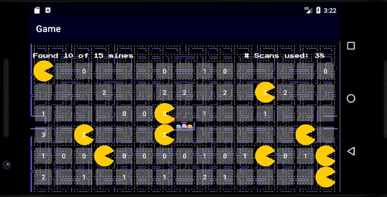
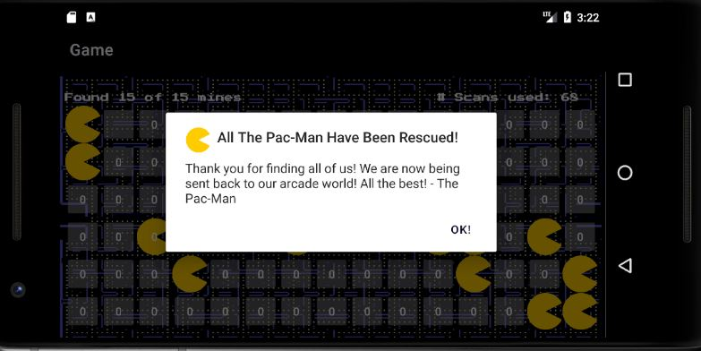

# 🎮 Pac-Man Mine Seeker

A **mine seeker** Android game with a retro **Pac-Man arcade theme**. Instead of finding mines, you rescue lost Pac-Man characters trapped in the arcade world!

<p align="center">
  
  
</p>

---

## 📖 About

Pac-Man Finder is an Android app built with **Java**. The game reimagines the classic mine sweeper mechanics with a fun Pac-Man twist—tap cells to scan for hidden Pac-Man characters and rescue them all!

### How to Play

1. **Start the game** from the main menu
2. **Tap any cell** on the grid to reveal what's underneath
3. If you find a **Pac-Man** 🟡 — you rescued one! The cell shows the Pac-Man icon
4. If a **number appears** — this is a scan result showing how many Pac-Man are hidden in that row + column combined
5. **Tap a found Pac-Man** to re-scan its row and column for more clues
6. **Find all Pac-Man** to win the game!

---

## ✨ Features

| Feature | Description |
|---------|-------------|
| 🎬 **Animated Welcome Screen** | Fade-in animations with auto-proceed after 4 seconds |
| 🕹️ **Arcade-Themed UI** | Retro pixel art backgrounds and custom fonts |
| 📊 **Customizable Board** | 3 board sizes: 4×6, 5×10, or 6×15 |
| 💣 **Adjustable Difficulty** | Choose 6, 10, 15, or 20 Pac-Man to find |
| 🔊 **Sound Effects** | Audio feedback for found/not found Pac-Man |
| 📡 **Scan Animations** | Visual sweep along rows and columns when scanning |
| 💾 **Persistent Settings** | Options saved via SharedPreferences |
| ❓ **Help Section** | In-app instructions and resource credits |

---

## 🏗️ Project Structure

```
app/src/main/java/ca/cmpt276/as3/
├── MainActivity.java         # Welcome screen with animations
├── MainMenuActivity.java     # Main menu navigation
├── GameActivity.java         # Core game logic and UI
├── OptionsActivity.java      # Board size and mine count settings
├── HelpActivity.java         # How to play instructions
├── HelpResourceActivity.java # Asset attributions
└── model/
    └── GameLogic.java        # Singleton for game state management
```

---

## 🛠️ Tech Stack

- **Language:** Java
- **Platform:** Android (Min SDK 24, Target SDK 31)
- **Build System:** Gradle
- **UI:** XML Layouts with View Binding
- **Architecture:** Singleton pattern for game state
- **Storage:** SharedPreferences for user settings

### Dependencies

- AndroidX AppCompat
- Material Design Components
- ConstraintLayout
- Navigation Components
- JUnit & Espresso (testing)

---

## 🚀 Getting Started

### Prerequisites

- Android Studio Arctic Fox or later
- JDK 8+
- Android SDK 31

### Installation

1. **Clone the repository**
   ```bash
   git clone <repository-url>
   ```

2. **Open in Android Studio**
   - File → Open → Select the project folder

3. **Build and Run**
   - Click the ▶️ Run button or use `Shift + F10`
   - Select an emulator or connected device (API 24+)

### Build APK

```bash
./gradlew assembleDebug
```

The APK will be generated at `app/build/outputs/apk/debug/app-debug.apk`


## Acknowledgments

- Background images from various sources (see in-app Resources section)
- Pac-Man icon from Wikimedia Commons
- Sound effects for game interactions
- Retro arcade fonts from Google Fonts

---
